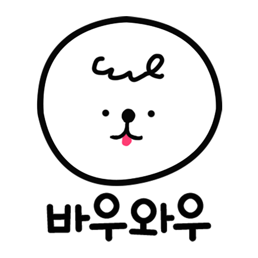
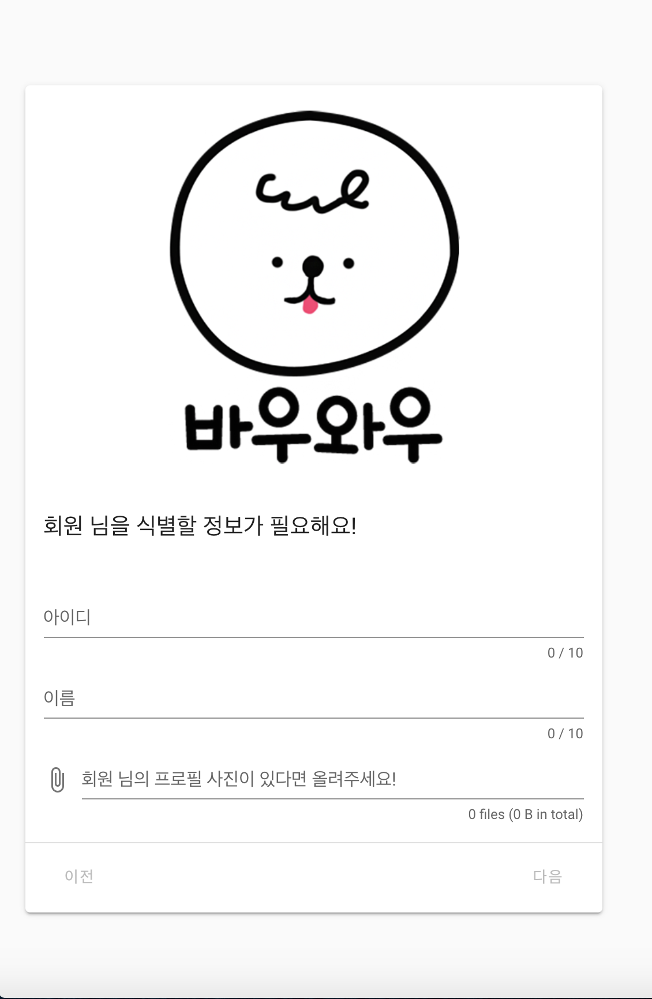
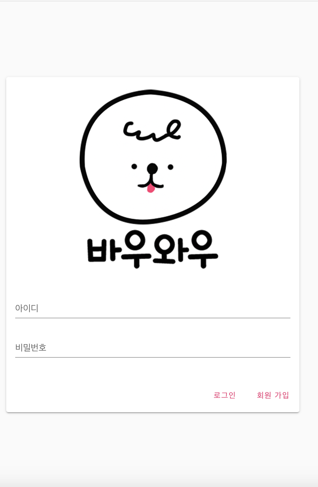
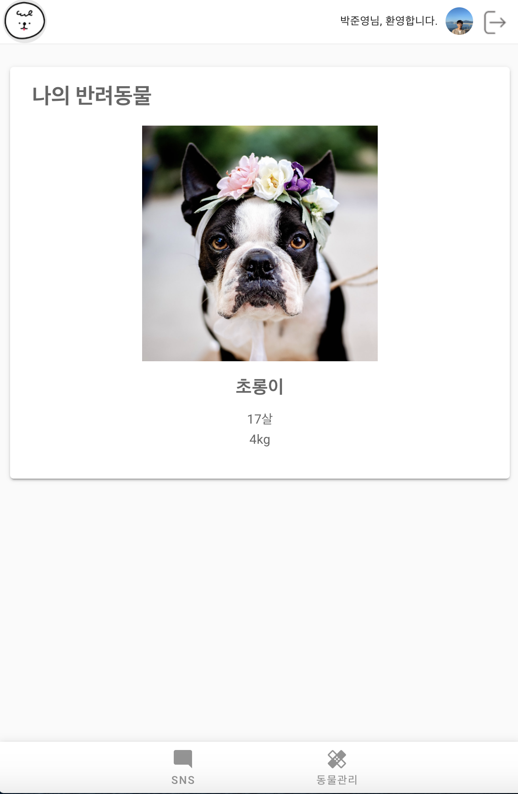
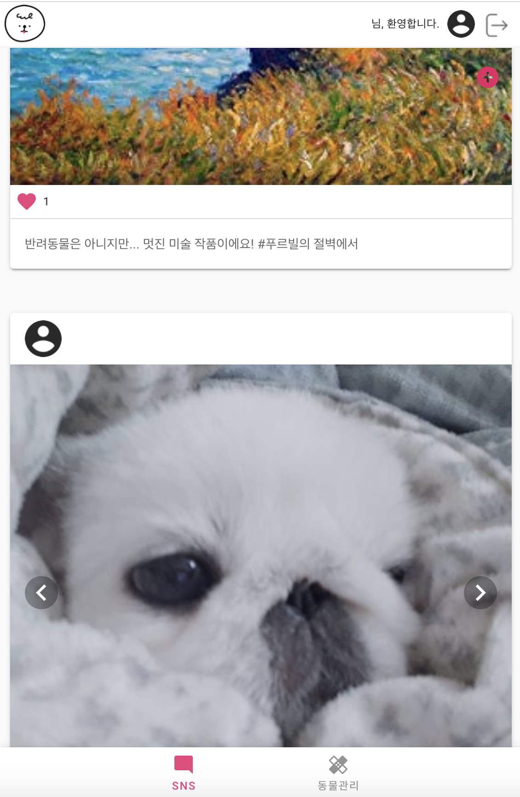
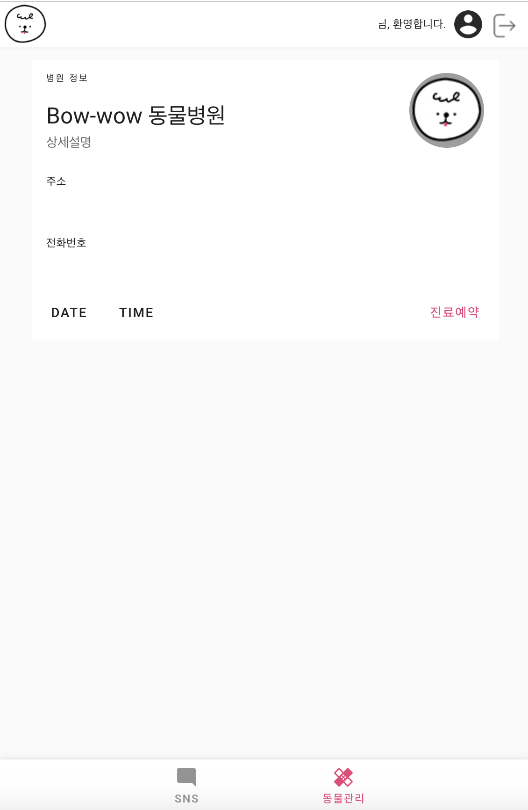
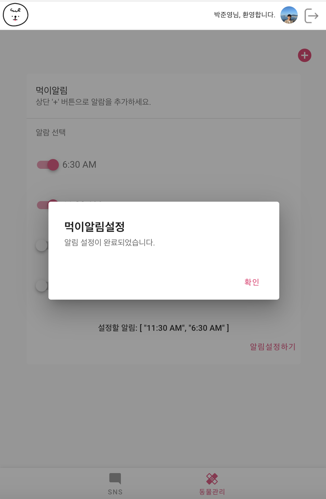

# 바우와우

🐶🐱🐦여러분의 반려 동물을 바우와우 앱으로 관리하세요!

## 👪 기여자

이 저장소에 대해 더 좋은 방향으로 기여할 수 있으면 언제든지 Issue 및 Pull Request를 열어주세요!

- [🔗Unperknown](https://github.com/Unperknown) : PWA 개발 및 백엔드 전반(Node), 기획 및 UX 보조
- [🔗winkpsj0529](https://github.com/winkpsj0529) : 프로덕트 기획, UI/UX 디자인, 프론트엔드(Vue)

## 🗓 마일스톤

### 11/13 - 프로젝트 착수 👩‍💻👨‍💻
### 12/11 - 프로젝트 산출물 제출 및 마감 😳😨~😱~
### 12/13 - 산출물 시연 및 프리젠테이션 👨‍🏫👩‍🏫

## 🔑 사용 기술


## 📱 릴리즈

### 1차 배포

#### 프로토타입

곧 업로드될 예정입니다! 😄

#### 산출물

한창 개발 중입니다!

## 👨🏻‍💻 실행 방법

### 프로젝트 실행
```
npm install
```

### 컴파일 및 핫-리로드
```
npm run serve
```

### 프로덕션용 컴파일
```
npm run build
```

### 자동 수정
```
npm run lint
```

### 11/13 ~ 11/15 - 아이디어 구상 및 확정!
프로젝트에 대한 회의를 거친 끝에 반려동물을 케어하고 관련 정보를 공유하며 반려동물을 키우는 데 필요한 진료 예약, 알림 등을 지원하는 애플리케이션을 만들기로 하였다. 여기서 이번 프로젝트의 요구사항이 다음과 같이 결정되었다.
1. 프로젝트는 PWA 애플리케이션으로 만들어지며 크로스 플랫폼을 지원하도록 한다.
2. 프론트엔드는 Vue, 백엔드는 Express로 제작한다.
3. 사용자는 등록한 반려동물의 정보를 홈 화면에서 볼 수 있다.
4. 사용자는 SNS 형식으로 자신의 반려동물에 대한 소식을 공유할 수 있다.
5. 언제든지 자신의 위치 주변에 있는 동물병원에 예약할 수 있어야 한다.
6. 반려동물에게 먹이를 주어야 하는 시간에 알림이 오도록 해야 한다.

### 11/18 ~ 11/20 - 애플리케이션 디자인

애플리케이션의 대표 로고를 다음과 같이 디자인하였다.

### 11/22 ~ 11/25 - 로그인 및 회원가입 UI 구현


!()[/doc/login.png]
로그인 및 회원가입 UI에 대한 프로토타입을 다음과 같이 결정하고 구현하였다.

### 11/27 ~ 11/29 - 메인 화면 UI 구현

메인 화면을 구성하는 ToolBar, BottomNavigation에 대한 UI를 구현하고 다음과 같이 디자인하였다.

### 12/2 ~ 12/4 - SNS 구현

반려동물 소식을 공유할 수 있는 SNS 화면을 다음과 같은 UI로 구현하였다.


### 12/5 ~ 12/6 - 반려동물 관리 구현


진료 예약과 먹이 시간 알람을 제작하였다.